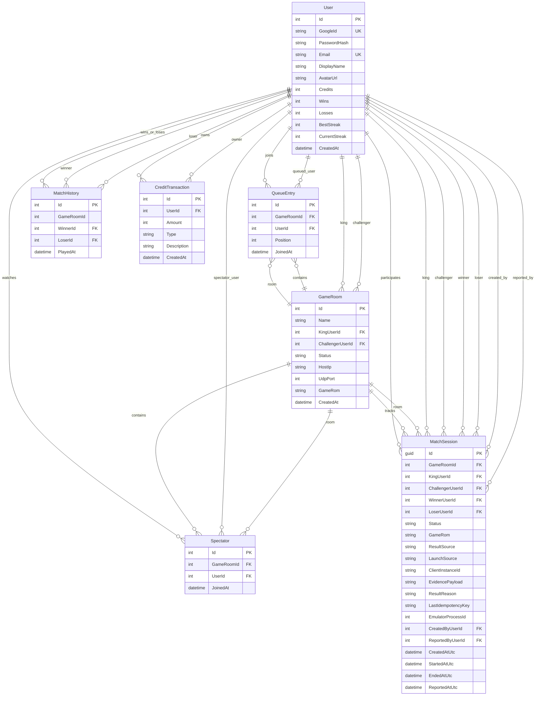

# Diagrama del Modelo de Datos

## Objetivo

Este documento contiene una versión separada y reutilizable del diagrama Mermaid del modelo de datos.

Está pensado para:

1. arquitectura;
2. documentación ejecutiva;
3. presentaciones;
4. revisión rápida de relaciones sin leer el detalle completo del modelo.

Para la explicación completa de cada entidad, ver [DATA-MODEL.md](DATA-MODEL.md).

---

## Diagrama ER

---

## Lectura rápida del diagrama

- `User` es la entidad central del sistema.
- `GameRoom` modela la sala activa con un `KingUserId` y un `ChallengerUserId` opcionales.
- `QueueEntry` y `Spectator` representan la vista viva de usuarios esperando o mirando.
- `MatchSession` modela la operación de una partida concreta y sirve para tracking, overlay y cierre manual.
- `MatchHistory` guarda solo resultados oficiales que impactan ranking.
- `CreditTransaction` funciona como ledger de créditos.

---

## Notas de uso

- Si necesitas contexto funcional, usa [MATCH-FLOW-AND-OVERLAY-DESIGN.md](MATCH-FLOW-AND-OVERLAY-DESIGN.md).
- Si necesitas detalle campo por campo y restricciones, usa [DATA-MODEL.md](DATA-MODEL.md).
