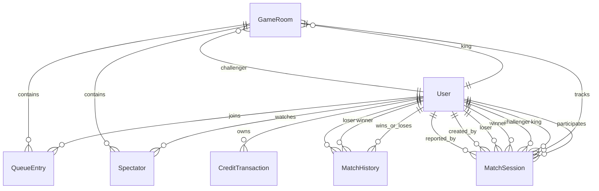

# Modelo de Datos

## Objetivo

Este documento describe el modelo de datos real que usa el backend `KingOfTheColonyApi` sobre SQLite mediante Entity Framework Core.

El objetivo del modelo es soportar:

1. autenticación de usuarios;
2. créditos para entrar a jugar;
3. salas activas de rey de la colina;
4. cola de retadores y espectadores;
5. historial de partidas y ranking;
6. sesiones de partida para cierre manual, overlay y reporte de resultado.

---

## Motor y persistencia

- Motor actual: `SQLite`
- ORM: `Entity Framework Core`
- `DbContext`: `AppDbContext`
- Base por defecto: `kingofthecolony.db`

Conjunto de entidades registradas en el contexto:

- `Users`
- `GameRooms`
- `QueueEntries`
- `Spectators`
- `MatchHistories`
- `MatchSessions`
- `CreditTransactions`

---

## Resumen de entidades

| Entidad             | Propósito                                                             |
| ------------------- | --------------------------------------------------------------------- |
| `User`              | Perfil del jugador, autenticación, créditos y estadísticas acumuladas |
| `GameRoom`          | Sala activa de rey de la colina                                       |
| `QueueEntry`        | Turnos de espera para desafiar al rey                                 |
| `Spectator`         | Usuarios observando una sala                                          |
| `MatchHistory`      | Registro histórico de victorias y derrotas                            |
| `MatchSession`      | Sesión operativa de una partida concreta                              |
| `CreditTransaction` | Movimientos de créditos del usuario                                   |

---

## Diagrama de relaciones

Si necesitas una versión separada del diagrama para arquitectura o presentaciones, usa [DATA-MODEL-DIAGRAM.md](DATA-MODEL-DIAGRAM.md).

---

## Entidades en detalle

### `User`

Representa una cuenta autenticable dentro de la plataforma.

Campos:

| Campo           | Tipo       | Requerido | Descripción                                                      |
| --------------- | ---------- | --------- | ---------------------------------------------------------------- |
| `Id`            | `int`      | Sí        | Clave primaria                                                   |
| `GoogleId`      | `string`   | Sí        | Identificador de Google; puede estar vacío si la cuenta es local |
| `PasswordHash`  | `string`   | Sí        | Hash PBKDF2 para login por correo/clave                          |
| `Email`         | `string`   | Sí        | Correo único del usuario                                         |
| `DisplayName`   | `string`   | Sí        | Nombre visible en ranking, cola y sala                           |
| `AvatarUrl`     | `string`   | Sí        | URL de avatar; actualmente puede quedar vacía                    |
| `Credits`       | `int`      | Sí        | Créditos disponibles para entrar a jugar                         |
| `Wins`          | `int`      | Sí        | Victorias acumuladas                                             |
| `Losses`        | `int`      | Sí        | Derrotas acumuladas                                              |
| `BestStreak`    | `int`      | Sí        | Mejor racha histórica                                            |
| `CurrentStreak` | `int`      | Sí        | Racha actual                                                     |
| `CreatedAt`     | `DateTime` | Sí        | Fecha de creación del usuario                                    |

Restricciones:

- índice único sobre `Email`
- índice único sobre `GoogleId`

Notas:

- el score de ranking no se guarda en tabla; se calcula como `Wins * 3 + BestStreak * 2 - Losses`
- el win rate tampoco se persiste; se calcula al construir DTOs

---

### `GameRoom`

Representa una sala activa de rey de la colina.

Campos:

| Campo              | Tipo       | Requerido | Descripción                             |
| ------------------ | ---------- | --------- | --------------------------------------- |
| `Id`               | `int`      | Sí        | Clave primaria                          |
| `Name`             | `string`   | Sí        | Nombre de la sala                       |
| `KingUserId`       | `int?`     | No        | Usuario que actualmente es el rey       |
| `ChallengerUserId` | `int?`     | No        | Usuario que actualmente desafía al rey  |
| `Status`           | `string`   | Sí        | Estado funcional de la sala             |
| `HostIp`           | `string?`  | No        | IP pública usada para el handshake/host |
| `UdpPort`          | `int`      | Sí        | Puerto UDP para FBNeo/GGPO              |
| `GameRom`          | `string`   | Sí        | ROM de juego, por defecto `kof2002`     |
| `CreatedAt`        | `DateTime` | Sí        | Fecha de creación                       |

Relaciones:

- `KingUserId -> User.Id`
- `ChallengerUserId -> User.Id`
- `GameRoom -> QueueEntries`
- `GameRoom -> Spectators`
- `GameRoom -> MatchSessions`

Comportamiento de borrado:

- `KingUserId` y `ChallengerUserId` usan `DeleteBehavior.SetNull`

Estados observados en el código:

- `Idle`
- `WaitingChallenger`
- `ReadyToPlay`
- `Playing`
- `ResultReview`

Notas:

- `ReadyToPlay` significa que ya hay rey y retador listos para lanzar una partida
- `Playing` indica que la sesión de partida ya fue marcada como iniciada

---

### `QueueEntry`

Representa un usuario esperando turno dentro de una sala.

Campos:

| Campo        | Tipo       | Requerido | Descripción                    |
| ------------ | ---------- | --------- | ------------------------------ |
| `Id`         | `int`      | Sí        | Clave primaria                 |
| `GameRoomId` | `int`      | Sí        | Sala a la que pertenece        |
| `UserId`     | `int`      | Sí        | Usuario en espera              |
| `Position`   | `int`      | Sí        | Posición actual en la cola     |
| `JoinedAt`   | `DateTime` | Sí        | Momento en que entró a la cola |

Restricciones:

- índice único compuesto sobre `GameRoomId + UserId`

Notas:

- un mismo usuario no puede aparecer dos veces en la cola de la misma sala
- cuando no hay retador actual, el usuario entra directamente como `ChallengerUserId` y no como `QueueEntry`

---

### `Spectator`

Representa un usuario que observa una sala sin estar jugando.

Campos:

| Campo        | Tipo       | Requerido | Descripción                        |
| ------------ | ---------- | --------- | ---------------------------------- |
| `Id`         | `int`      | Sí        | Clave primaria                     |
| `GameRoomId` | `int`      | Sí        | Sala observada                     |
| `UserId`     | `int`      | Sí        | Usuario espectador                 |
| `JoinedAt`   | `DateTime` | Sí        | Momento de entrada como espectador |

Restricciones:

- índice único compuesto sobre `GameRoomId + UserId`

Notas:

- si un espectador entra a la cola, el sistema lo elimina de `Spectators`

---

### `MatchHistory`

Representa el histórico oficial de resultados que sí impactan ranking.

Campos:

| Campo        | Tipo       | Requerido | Descripción                   |
| ------------ | ---------- | --------- | ----------------------------- |
| `Id`         | `int`      | Sí        | Clave primaria                |
| `GameRoomId` | `int`      | Sí        | Sala donde ocurrió la partida |
| `WinnerId`   | `int`      | Sí        | Usuario ganador               |
| `LoserId`    | `int`      | Sí        | Usuario perdedor              |
| `PlayedAt`   | `DateTime` | Sí        | Fecha oficial del resultado   |

Relaciones:

- `WinnerId -> User.Id`
- `LoserId -> User.Id`

Restricciones:

- ambas relaciones usan `DeleteBehavior.Restrict`

Notas:

- `MatchHistory` se inserta solo cuando una partida se registra como resultado oficial
- una partida cancelada o enviada a revisión no debe generar `MatchHistory`

---

### `MatchSession`

Representa una partida concreta desde que el launcher la crea hasta que queda completada, cancelada o enviada a revisión.

Es la entidad clave para integrar:

- overlay WPF;
- tracking del proceso de FBNeo;
- cierre manual de partida;
- futura detección automática de ganador;
- idempotencia al reportar el resultado.

Campos:

| Campo                | Tipo        | Requerido | Descripción                                                     |
| -------------------- | ----------- | --------- | --------------------------------------------------------------- |
| `Id`                 | `Guid`      | Sí        | Identificador global de la sesión                               |
| `GameRoomId`         | `int`       | Sí        | Sala a la que pertenece                                         |
| `KingUserId`         | `int`       | Sí        | Rey al momento de iniciar la sesión                             |
| `ChallengerUserId`   | `int`       | Sí        | Retador al momento de iniciar la sesión                         |
| `WinnerUserId`       | `int?`      | No        | Ganador oficial cuando existe                                   |
| `LoserUserId`        | `int?`      | No        | Perdedor oficial cuando existe                                  |
| `Status`             | `string`    | Sí        | Estado de la sesión                                             |
| `GameRom`            | `string`    | Sí        | Juego lanzado                                                   |
| `ResultSource`       | `string`    | Sí        | Fuente del resultado (`ManualSelection`, `AutoDetection`, etc.) |
| `LaunchSource`       | `string`    | Sí        | Cliente que creó la sesión                                      |
| `ClientInstanceId`   | `string`    | Sí        | Identificador lógico de la instancia cliente                    |
| `EvidencePayload`    | `string?`   | No        | JSON con evidencia del resultado                                |
| `ResultReason`       | `string?`   | No        | Motivo en cancelación o revisión                                |
| `LastIdempotencyKey` | `string?`   | No        | Clave para evitar duplicados al completar                       |
| `EmulatorProcessId`  | `int?`      | No        | PID del proceso FBNeo reportado por el launcher                 |
| `CreatedByUserId`    | `int`       | Sí        | Usuario que creó la sesión                                      |
| `ReportedByUserId`   | `int?`      | No        | Usuario que reportó cierre o resultado                          |
| `CreatedAtUtc`       | `DateTime`  | Sí        | Fecha de creación                                               |
| `StartedAtUtc`       | `DateTime?` | No        | Fecha en que la sesión pasó a running                           |
| `EndedAtUtc`         | `DateTime?` | No        | Fecha en que el emulador cerró o se cerró la sesión             |
| `ReportedAtUtc`      | `DateTime?` | No        | Fecha de confirmación del cierre                                |

Relaciones:

- `GameRoomId -> GameRoom.Id`
- `KingUserId -> User.Id`
- `ChallengerUserId -> User.Id`
- `WinnerUserId -> User.Id`
- `LoserUserId -> User.Id`
- `CreatedByUserId -> User.Id`
- `ReportedByUserId -> User.Id`

Restricciones e índices:

- índice sobre `GameRoomId + Status`
- relaciones a usuarios con `DeleteBehavior.Restrict`

Estados observados o esperados por la lógica:

- `Created`
- `Running`
- `Completed`
- `Cancelled`
- `PendingReview`

Notas:

- el backend valida que solo exista una sesión activa por sala con ciertos estados
- `LastIdempotencyKey` se usa para tolerar reintentos al registrar resultado
- `EvidencePayload` está pensado como JSON serializado, no como columnas sueltas

---

### `CreditTransaction`

Representa el ledger de créditos del usuario.

Campos:

| Campo         | Tipo       | Requerido | Descripción                       |
| ------------- | ---------- | --------- | --------------------------------- |
| `Id`          | `int`      | Sí        | Clave primaria                    |
| `UserId`      | `int`      | Sí        | Usuario dueño del movimiento      |
| `Amount`      | `int`      | Sí        | Cantidad, positiva o negativa     |
| `Type`        | `string`   | Sí        | Tipo lógico del movimiento        |
| `Description` | `string?`  | No        | Descripción humana del movimiento |
| `CreatedAt`   | `DateTime` | Sí        | Fecha del movimiento              |

Valores típicos de `Type` vistos en código:

- `Purchase`
- `GameEntry`
- `Refund`
- `Admin`

Notas:

- al entrar a cola se descuenta 1 crédito y se registra un `GameEntry`
- al agregar créditos se genera una transacción `Purchase`

---

## Reglas de negocio derivadas del modelo

### Créditos

- un usuario necesita al menos `1` crédito para entrar a jugar
- entrar a cola consume `1` crédito
- los créditos se auditán mediante `CreditTransaction`

### Rey y retador

- `GameRoom.KingUserId` representa al rey actual
- `GameRoom.ChallengerUserId` representa al jugador que pelea en la partida actual o siguiente
- si no existe challenger, el primer usuario que entra a jugar ocupa ese lugar directamente

### Cola

- la cola solo contiene jugadores que aún no son el retador actual
- después de una partida completada, el siguiente challenger sale de la cola ordenada por `Position`
- luego la cola se reindexa

### Ranking

- el ranking no tiene tabla propia
- se calcula a partir de `User.Wins`, `User.Losses` y `User.BestStreak`

### Historial vs sesión de partida

- `MatchSession` modela la operación en vivo
- `MatchHistory` modela el resultado oficial e histórico
- no toda `MatchSession` genera un `MatchHistory`

---

## Restricciones importantes del modelo actual

1. `GoogleId` y `Email` son únicos a nivel de usuario.
2. Un usuario no puede duplicarse en la cola de una misma sala.
3. Un usuario no puede duplicarse como espectador en la misma sala.
4. `MatchSession` puede referenciar múltiples roles de usuario, por eso todas esas FK usan relaciones separadas.
5. Las relaciones históricas sensibles (`Winner`, `Loser`, `King`, `Challenger`, etc.) usan borrado restringido o nulable según el caso para no romper consistencia histórica.

---

## Posibles extensiones futuras

El modelo actual ya permite crecer hacia:

- confirmación dual de resultado;
- detección automática del ganador;
- soporte de múltiples juegos;
- temporadas de ranking;
- auditoría administrativa de resultados en conflicto;
- monetización o catálogo de créditos.

Si eso se implementa, lo más probable es extender `MatchSession` antes que crear tablas paralelas.
